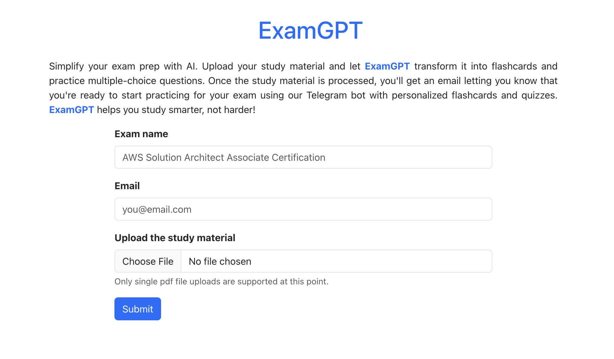
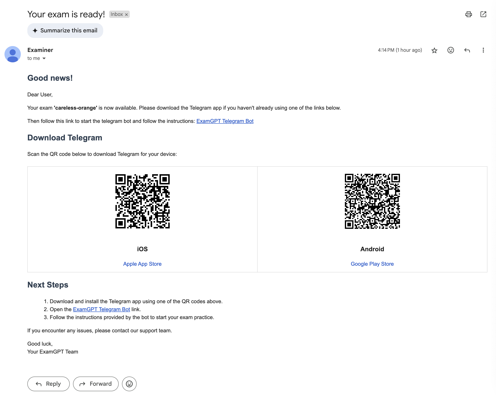
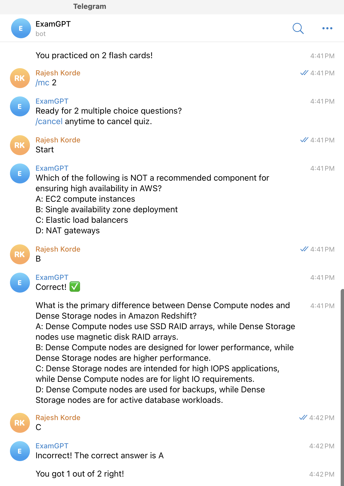
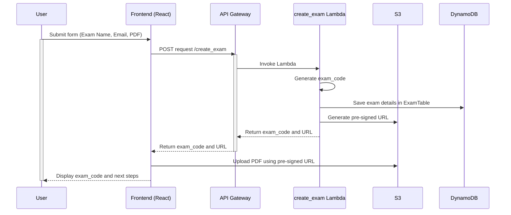
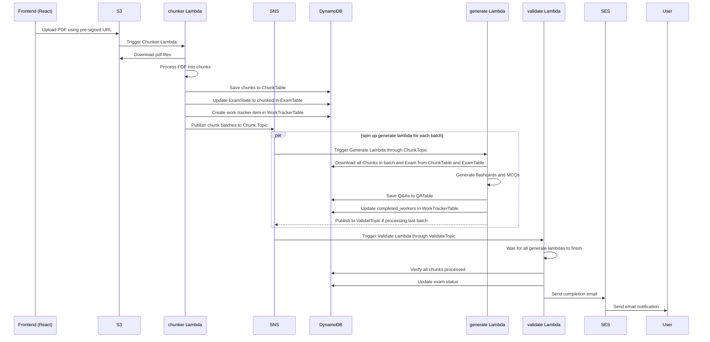
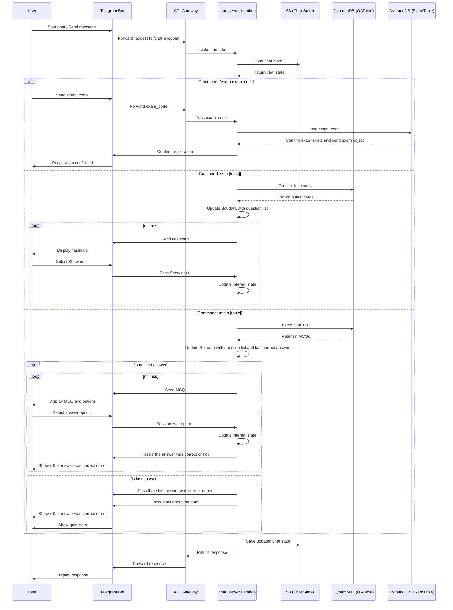
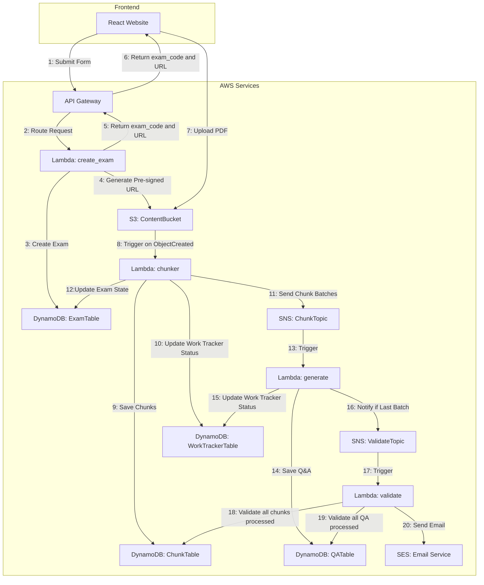

# ExamGPTCloud

## 1. Project Overview

ExamGPT helps users prepare for their exams by automatically generating flashcards and multiple-choice questions from their study materials (eg. PDF files). Studying techniques like [Spaced Repetition](https://en.wikipedia.org/wiki/Spaced_repetition) and [Retreival learning](https://ctl.wustl.edu/resources/using-retrieval-practice-to-increase-student-learning/) are common among students and creating high quality flash cards is a key component of these learning methods. There are software solutions like Anki and Quizlet that let students use flash cards effectively, but creating these flash cards is a time consuming process. This project attempts to solve that problem using AI.

In ExamGPT, users goto a [website](https://myexamgpt.com/) and upload the their study material and get an exam code. Once ExamGPT is done processing the study material, it sends the user an email signalling completion and detailing next steps. Then the user can download [Telegram](https://telegram.org/) and practice using flashcards and multiple choice questions (MCQs) using their exam code and the ExamGPT telegram bot.

The infrastructure is implemented using AWS. The frontend is a simple React App hosted as a static S3 website. The backend is fully serverless and easily scalable and uses a number of AWS services.

## 2. Demo

### 2.1 Demo Video

[](https://www.youtube.com/watch?v=brRJYeuvS3Q)

### 2.2 Demo Screenshots

**Website Screenshot**



**Email Screenshot**



**Telegram bot Screenshot**



## 3. System Architecture

### 3.1 Software design

The implementation follows the [hexagonal architecture](<https://en.wikipedia.org/wiki/Hexagonal_architecture_(software)>) and the create_exam() API is handled roughly as a choreographed [SAGA pattern](https://microservices.io/patterns/data/saga.html).

Most of the backend code resides in `examgpt-backend/examgpt-backend`. Following the practices of hexagonal architecture, the folder structure is broken down as follows:

- `entrypoints` - contains code for all the lambda handlers.
- `domain` - This folder handles all the core classes and logic, domain commands and abstractions
  - `model` - Contains all the core classes.
  - `ports` - Contains all the abstract classes for external service integration
  - `commands` - Contains classes that define the inputs for all the domain commands (eg create_exam, save_chunk etc). All inputs for all commands are pydantic classes, so the input validation logic for domain commands is separated from business logic.
  - `command_handlers` - Contains the implementation for all the domain commands (eg create_exam, save_chunk etc) using the service abstractions defined in ports folder.
  - `ai` - Contains implementation for AI based code using the service abstractions defined in ports folder.
  - `chat` - Contains helper classes for Telegram Bot implementation
  - `chunker` - Contains abstractionss and concrete classes for chunking pdf files.
- `adapter` - Contains the concrete classes that implement all the abstractions from ports directory
  - `aws` - Contains implementation of all AWS related services
  - `ai` - Contains implementation of all AI related services.

### 3.2 System Design

### Create Exam Form submission sequence diagram

This diagram shows the simplified version of the sequence of events when the user submits a create exam form. For ease of understanding, the diagram has been broken into 2 parts: One for what happens when a user submits a form and uploads the study material. And another for the sequence of events that follow uploads of the pdf file to S3 which triggers the next set of background processing.

**Sequence diagram for exam form submission and upload study material**



<br/>
<br/>
<br/>

**Sequence diagram for post file upload**



<br/>
<br/>
<br/>

### Telegram chatbot sequence diagram

This diagram shows the simplified version of sequence of events when the user chats with the Telgram Chat bot



<br/>
<br/>
<br/>

## 4. Data Flow Diagram

The DFD below shows the simplified version of how the form submission for creating a new exam works.



## 5. Components

### 5.1 Frontend

- Domain: http://myexamgpt.com
- Technology: React.js, Bootstrap
- Requirements: Works on all mobile, tablets and desktop.
- Hosting: AWS S3 (Static Website Hosting)
- Features:
  - Inform the user User about ExamGPT.
  - Get input form for Exam Name, Email, and PDF upload and send to backend.
  - Upload Study material (refered to PDF file from here on) to pre-signed URL provided by backend.
  - Displays exam_code after submission and show next steps.

### 5.2 Backend

- AWS Lambda Functions

  - `create_exam`:
    - Creates the initial Exam and pre-signed URL
    - Trigger: /create_exam in API Gateway
    - Inputs: Exam Name, Email, pdf File location
    - Functionality:
      - Creates an Exam object with a unique exam_code
      - Stores Exam object with all exam details in ExamTable (DynamoDB).
      - Generates a pre-signed S3 URL and sends it (and exam_code) to frontend.
    - Notes:
      - Uses pre-signed S3 URL because direct upload through API gateway has a limit of 10 MB. Upload using pre-signed S3 URL is 5 GB.
  - `chunker`:
    - Chunks pdf files into small chunks and triggers a series of generate lambdas that will create flashcards and multiple choices questions (refered to QA henceforth) for each of the chunks
    - Trigger: S3 ObjectCreated event.
    - Inputs: bucket_name, location (of the object), exam_code (extracted from object path)
    - Functionality:
      - Downloads study material from S3
      - Chunks PDF into smaller parts.
      - Stores chunks in ChunkTable (DynamoDB).
      - Creates ExamTracker object and saves in WorkTrackerTable (DynamoDB). This table is used for handling race conditions when various generate lambdas finish.
      - Updates Exam state to CHUNKED.
      - Breaks list of chunks in batches of CHUNK_BATCH_SIZE and publishes one SNS messages to ChunkTopic for each batch.
    - Notes:
      - Since spinning up a new lambda for each chunk would be slow and spinning up only a single lambda would not be practical (because of 15 minute execution limits of AWS lambdas), a batching approach is used. Each generate lambda would handle a batch of chunks.
      - To ensure that we can track the completion of all of the generate lamdbas, a work tracker table is used that tracks the completion of each generate lambda.
  - `generate`:

    - Generate a set of QA (flash cards and multiple choices) for a batch of chunks using AI.
    - Trigger: Subscribed to SNS ChunkTopic
    - Inputs: list of chunk_ids (indicating the batch), exam_code, last_chunk (indicating whether this is the last batch of chunks)
    - Functionality:

      - Get all chunk objects and exam object from DynamoDB tables (ExamTable and ChunkTable)
      - Get model keys from SSM
      - Generates flashcards and MCQs for each chunk.
      - For each chunk that generates at least one Flashcard or MCQ, sets the appropriate flags in the ChunkTable
      - Stores all Flashcards and MCQs in QATable (DynamoDB).
      - Once it is done with the work, updates the completed_worker count in WorkTrackerTable.
      - If its the last batch, publishes SNS message to ValidateTopic.

    - Notes:
      - The AI model first checks if the chunk has enough content to generate a flashcard or MCQ. Sometimes the chunk is mainly comprised on Table of Contents or copyright notices etc, so this is skipped

  - `validate`:

    - Validates that QA has been generated correctly for an exam. Publishes some stats on the QA generation.
    - Trigger: Subscribed to SNS ValidateTopic
    - Input: exam_code
    - Functionality
      - Gets Exam object from ExamTable (DynamoDB).
      - Waits for all generate lambdas to finish using the WorkTrackerTable (or times out).
      - Gets Chunks and QAs from DynamoDB and publishes stats on processing of the exam.
      - If most of the chunks are processed (controlled by CHUNK_PROCESSED_RATIO), considers the QA generation as complete.
      - If QA generation is complete, sends completion email to user via SES.

  - `chat_server`:
    - Handles Telegram bot interactions.
    - Trigger: /chat in API gateway
    - Functionality:
      - Gets telegram bot token from SSM
      - Loads chat state from S3
      - Initializes Telegram bot application with persistence initialized with chat state
      - Processes the message using CommandHandlers and ConversationHandlers
      - Saves chat state back to S3
    - Notes:
      - Chat state is stored in pickle format.

- Other AWS Services

  - API Gateway: Routes HTTP requests to Lambda functions.
  - SSM Parameter Store: Config management for app (Secrets, Config, Runtime Environment etc)
  - DynamoDB Tables:
    - ExamTable: Stores exam metadata.
    - ChunkTable: Stores chunk information.
    - QATable: Stores generated flashcards and MCQs.
    - WorkTrackerTable: Stores generate lamdba state
  - Amazon S3:
    - Stores uploaded PDFs (ContentBucket).
    - Stores the telegram chat state (ChatBucket).
    - Hosts the react frontend app (Domain Name).
  - Amazon SNS (Simple Notification Service):
    - Topics: ChunkTopic, ValidateTopic.
    - Facilitates communication between Lambdas.
  - Amazon SES (Simple Email Service):
    - Sends emails to users upon exam readiness.
  - Amazon CloudFront/Route 53:
    - Improves response times of the frontend
  - Amazon CloudWatch for all logs.

### 5.3 Third-Party Services

- Telegram Bot:

  - Provides an interactive interface for users to practice.
  - Communicates with ChatServer via API Gateway using a web hook.

- AI model providers:
  - Creates Flash cards and MCQs from a given chunk of text.

## 6. AI Model

- Foundation LLMs are used to generate Flash cards and MCQs from a given chunk. Any good model can be used with very minor changes in code. Current implementation uses OpenAI's gpt-4o-mini.
- Each chunk is first evaluated to see if there is enough information in the chunk to create a meaningful question. Often times when a chunk is comprised of things like table of contents or copyright notices, there is no point in creating QA from this.
- Model prompts can be customized for each model and scenario and are saved as a yaml file, so they can be versions.
- Models are instructed to respond in a specific json format derived from FlashCard and MultipleChoice classes and formatting is enforced automatically using pydantic.
- Currently json mode is being used for OpenAI, because constrained sampling wasnt released when the project started.

## 7. Chat interface

The chat interface is implemented as a Telegram chat bot. Telegram bots work by exposing certain commands to the user. The following commands are currently available.

- `/start` or `/help`: Provides an overview of all commands for the chatbot. Implemented as CommandHandler.
- `/exam exam_code`: This command is used by the user to set the exam code in the interface, so that they can start practicing for this specific exam. Implemented as CommandHandler.
- `/fc n [topic]`: Users use this command to start practices n random flashcards. If n is not provided, default is 1. The n flashcards are randomly chosen from all the flashcards. User can specify an optional but arbitrary topic, that would let them practice on flash cards related to a specific topic only. This functionality is not implemented.
- `/mc n [topic]`: Same as flashcards, but for multiple choice questions.

## 8. Data Models

All tables are implemented in Dyanmodb.

`ExamTable`

- Primary Key: exam_code (String)
- Attributes:
  - email: String
  - name: String
  - sources: List[String]
  - state: String (Enum)
  - last_updated: String

`ChunkTable`

- Primary Key: chunk_id (String)
- Sort Key: exam_code (String)
- Attributes:
  - flash_card_generated: Boolean
  - multiple_choice_generated: Boolean
  - is_empty_context: Boolean
  - text: String: String

`QATable`

model_family is used for model provider (eg OpenAI, Google etc) and model_name is the specific model (eg gpt-4o). type is used to indicate whether the question is a flashcard or a multiple choice.

- Primary Key: qa_id (String)
- Sort Key: exam_code (String)
- Attributes:
  - question: String
  - answer: String
  - choices: Map
  - chunk_id: String
  - model_family: String
  - model_name: String
  - type: String (Enum)
  - last_updated: String

`WorkTrackerTable`

- Primary Key: qa_id (String)
- Attributes:
  - exam_code: String
  - total_workers: Number
  - completed_workers: Number

## 9. API Specifications

- `POST /create_exam`

  - Description: Initiates exam creation. exam_code is not shown in UI, it is only for internal use. The pre-signed URL itself is comprised on the url itself and a dict of fields like TTL, object location etc.
  - Request body:

    ```code
      {
          "exam_name": "string",
          "filenames": "string",
          "email": "string",
          "exam_code": "string"
      }
    ```

  - Response body:

    ```code
    {
        "exam_code": "string",
        "url": "string"
    }
    ```

- `POST /chat`

  - Description: Handles Telegram bot webhooks.
  - Request Body: Telegram's message format.
  - Response: Depends on bot interaction.

## 10. Security Considerations

- Data Protection:
  - Use HTTPS for all API communications.
  - Encrypt sensitive data at rest and in transit.
  - All secrets are encoded inside SSM.
- Access Control:
  - Implement IAM roles with the least privilege principle.
  - Pre-signed URLs expire after a short duration.

## 11. Deployment

- Backend:
  - Entire backend is configured and deployed as Infra as code using AWS SAM template and CloudFormation.
  - Secrets are uploaded from a .env file to SSM using a python script.
- Frontend:
  - Front end deployment is currently manual. Build React app (npm run build) and deploy to S3 bucket configured for static website hosting through AWS Console (or aws s3 sync)
  - Note: SES can currently only send mails to pre-verified email addresses since I dont have production access yet

## 12. Incomplete work

- Work: Email delivery to pre-verified addresses only due to staging access.

  - Next Steps: Implement Bounce strategy and apply for SES prod access.

- Work: PDF chunking uses pymupdf library, which is not very effective

  - Next Steps: While this works for the most part, it cannot handle images and tables inside pdf. There are many better libraries available, but they use torch. Downloading torch on lambda would exceed the allowed deployed package limits provided by AWS. The solution requires a major rearchitecture (move to EKS/ECS)

- Work: AI model uses json mode, which is more error prone
  - Next Steps: Contrained sampling was introduced while this project was underway, so switching to that would improve reliability (and code simplicity) for the structured output calls.
