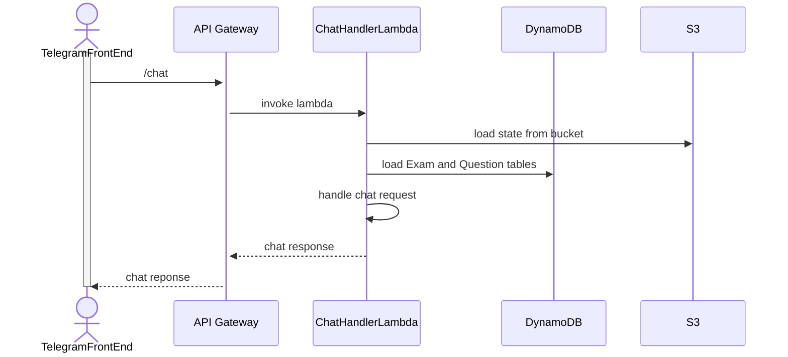

```mermaid
sequenceDiagram
  actor fe as TelegramFrontEnd
  participant ag as API Gateway
  participant chl as ChatHandlerLambda
  participant ddb as DynamoDB
  participant s3 as S3


  activate fe
  fe ->>+ ag: /chat
  ag ->> chl: invoke lambda
  chl ->> s3: load state from bucket
  chl ->> ddb: load Exam and Question tables
  chl ->> chl: handle chat request
  chl -->> ag: chat response
  ag -->> fe: chat reponse
  deactivate fe
```
