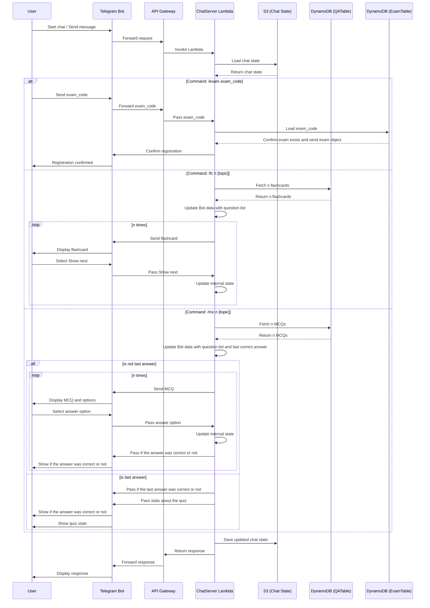

```mermaid
sequenceDiagram
    participant U as User
    participant TB as Telegram Bot
    participant AG as API Gateway
    participant CSL as ChatServer Lambda
    participant S3 as S3 (Chat State)
    participant DDB as DynamoDB (QATable)
    participant ExamDDB as DynamoDB (ExamTable)

    U->>TB: Start chat / Send message
    TB->>AG: Forward request
    AG->>CSL: Invoke Lambda
    CSL->>S3: Load chat state
    S3-->>CSL: Return chat state


    alt Command: /exam exam_code
        U->>TB: Send exam_code
        TB->>AG: Forward exam_code
        AG->>CSL: Pass exam_code
        CSL->>ExamDDB: Load exam_code
        ExamDDB-->>CSL: Confirm exam exists and send exam object
        CSL->>TB: Confirm registration
        TB->>U: Registration confirmed
    else Command: /fc n [topic]
        CSL->>DDB: Fetch n flashcards
        DDB-->>CSL: Return n flashcards
        CSL->>CSL: Update Bot data with question list
        loop n times
            CSL->>TB: Send flashcard
            TB->>U: Display flashcard
            U->>TB: Select Show next
            TB->>CSL: Pass Show next
            CSL->>CSL: Update internal state
        end
    else Command: /mc n [topic]
        CSL->>DDB: Fetch n MCQs
        DDB-->>CSL: Return n MCQs
        CSL->>CSL: Update Bot data with question list and last correct answer
        alt is not last answer
            loop n times
                CSL->>TB: Send MCQ
                TB->>U: Display MCQ and options
                U->>TB: Select answer option
                TB->>CSL: Pass answer option
                CSL->>CSL: Update internal state
                CSL->>TB: Pass if the answer was correct or not
                TB->>U: Show if the answer was correct or not
            end
        else is last answer
            CSL->>TB: Pass if the last answer was correct or not
            CSL->>TB: Pass stats about the quiz
            TB->>U: Show if the answer was correct or not
            TB->>U: Show quiz stats
        end
    end

    CSL->>S3: Save updated chat state
    CSL->>AG: Return response
    AG->>TB: Forward response
    TB->>U: Display response

```
