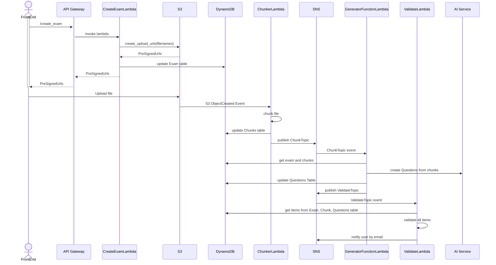

```mermaid
sequenceDiagram
  actor fe as FrontEnd
  participant ag as API Gateway
  participant cel as CreateExamLambda
  participant S3
  participant ddb as DynamoDB
  participant cl as ChunkerLambda
  participant SNS
  participant gfl as GeneratorFunctionLambda
  participant vl as ValidateLambda
  participant ai as AI Service

  # Upload file - Get presigned URL
  activate fe
  fe ->>+ ag: /create_exam
  ag ->> cel: invoke lambda
  cel ->> S3: create_upload_urls(filenames)
  S3 -->> cel: PreSignedUrls
  cel ->> ddb: update Exam table
  cel -->> ag: PreSignedUrls
  ag -->> fe: PreSignedUrls
  deactivate fe

  # Upload file - Upload to presigned URL
  fe ->> S3: Upload file

  # Chunk File

  S3 ->> cl: S3 ObjectCreated Event
  cl ->> cl: chunk file
  cl ->> ddb: update Chunks table
  cl ->> SNS: publish ChunkTopic

  # Generate QA

  SNS ->> gfl: ChunkTopic event
  gfl ->> ddb: get exam and chunks
  gfl ->> ai: create Questions from chunks
  gfl ->> ddb: update Questions Table
  gfl ->> SNS: publish ValidateTopic

  # Validate
  SNS ->> vl: ValidateTopic event
  vl ->> ddb: get items from Exam, Chunk, Questions table
  vl ->> vl: validate all items
  vl ->> SNS: notify user by email
```
