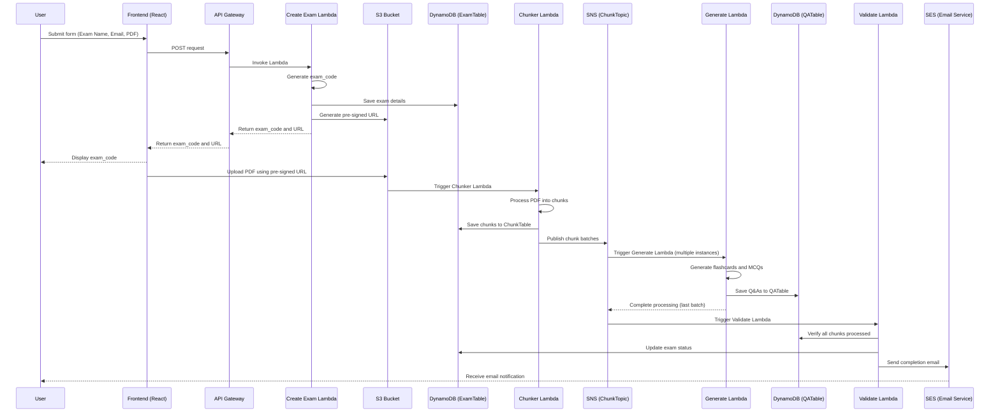

```mermaid
sequenceDiagram
    participant U as User
    participant FE as Frontend (React)
    participant AG as API Gateway
    participant CEL as Create Exam Lambda
    participant S3 as S3 Bucket
    participant DDB as DynamoDB (ExamTable)
    participant CL as Chunker Lambda
    participant SNS as SNS (ChunkTopic)
    participant GL as Generate Lambda
    participant QA as DynamoDB (QATable)
    participant VL as Validate Lambda
    participant SES as SES (Email Service)

    U->>FE: Submit form (Exam Name, Email, PDF)
    FE->>AG: POST request
    AG->>CEL: Invoke Lambda
    CEL->>CEL: Generate exam_code
    CEL->>DDB: Save exam details
    CEL->>S3: Generate pre-signed URL
    CEL-->>AG: Return exam_code and URL
    AG-->>FE: Return exam_code and URL
    FE-->>U: Display exam_code
    FE->>S3: Upload PDF using pre-signed URL
    S3->>CL: Trigger Chunker Lambda
    CL->>CL: Process PDF into chunks
    CL->>DDB: Save chunks to ChunkTable
    CL->>SNS: Publish chunk batches
    SNS->>GL: Trigger Generate Lambda (multiple instances)
    GL->>GL: Generate flashcards and MCQs
    GL->>QA: Save Q&As to QATable
    GL-->>SNS: Complete processing (last batch)
    SNS->>VL: Trigger Validate Lambda
    VL->>QA: Verify all chunks processed
    VL->>DDB: Update exam status
    VL->>SES: Send completion email
    SES-->>U: Receive email notification

```
