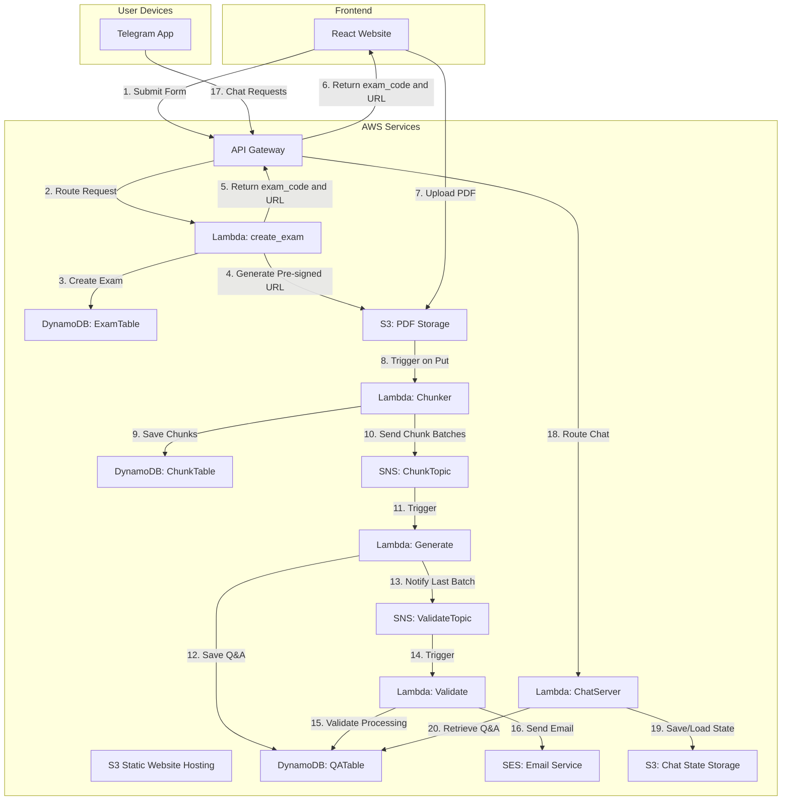

```mermaid
graph TB
    subgraph "Frontend"
        A[React Website]
    end

    subgraph "AWS Services"
        B[S3 Static Website Hosting]
        C[API Gateway]
        D[Lambda: create_exam]
        E[DynamoDB: ExamTable]
        F[S3: PDF Storage]
        G[Lambda: Chunker]
        H[DynamoDB: ChunkTable]
        I[SNS: ChunkTopic]
        J[Lambda: Generate]
        K[DynamoDB: QATable]
        L[SNS: ValidateTopic]
        M[Lambda: Validate]
        N[SES: Email Service]
        O[Lambda: ChatServer]
        P[S3: Chat State Storage]
    end

    subgraph "User Devices"
        Q[Telegram App]
    end

    A -->|1. Submit Form| C
    C -->|2. Route Request| D
    D -->|3. Create Exam| E
    D -->|4. Generate Pre-signed URL| F
    D -->|5. Return exam_code and URL| C
    C -->|6. Return exam_code and URL| A
    A -->|7. Upload PDF| F
    F -->|8. Trigger on Put| G
    G -->|9. Save Chunks| H
    G -->|10. Send Chunk Batches| I
    I -->|11. Trigger| J
    J -->|12. Save Q&A| K
    J -->|13. Notify Last Batch| L
    L -->|14. Trigger| M
    M -->|15. Validate Processing| K
    M -->|16. Send Email| N
    Q -->|17. Chat Requests| C
    C -->|18. Route Chat| O
    O -->|19. Save/Load State| P
    O -->|20. Retrieve Q&A| K
```
