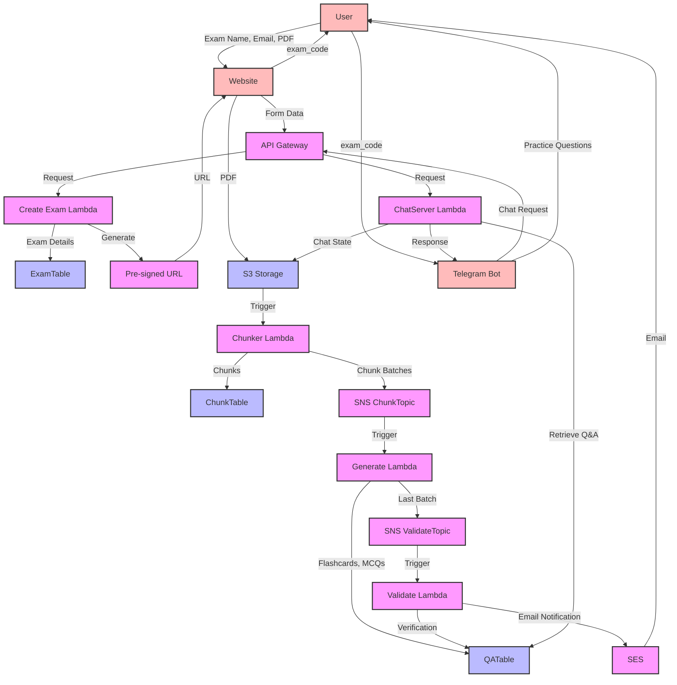

```mermaid
graph TD
    U[User] -->|Exam Name, Email, PDF| W[Website]
    W -->|Form Data| AG[API Gateway]
    AG -->|Request| CE[Create Exam Lambda]
    CE -->|Exam Details| ET[ExamTable]
    CE -->|Generate| PS[Pre-signed URL]
    PS -->|URL| W
    W -->|exam_code| U
    W -->|PDF| S3[S3 Storage]
    S3 -->|Trigger| CL[Chunker Lambda]
    CL -->|Chunks| CT[ChunkTable]
    CL -->|Chunk Batches| SNS[SNS ChunkTopic]
    SNS -->|Trigger| GL[Generate Lambda]
    GL -->|Flashcards, MCQs| QA[QATable]
    GL -->|Last Batch| VT[SNS ValidateTopic]
    VT -->|Trigger| VL[Validate Lambda]
    VL -->|Verification| QA
    VL -->|Email Notification| SES[SES]
    SES -->|Email| U
    U -->|exam_code| TB[Telegram Bot]
    TB -->|Chat Request| AG
    AG -->|Request| CSL[ChatServer Lambda]
    CSL -->|Chat State| S3
    CSL -->|Retrieve Q&A| QA
    CSL -->|Response| TB
    TB -->|Practice Questions| U

    classDef process fill:#f9f,stroke:#333,stroke-width:2px;
    classDef data fill:#bbf,stroke:#333,stroke-width:2px;
    classDef external fill:#fbb,stroke:#333,stroke-width:2px;

    class U,W,TB external;
    class ET,CT,QA,S3 data;
    class CE,CL,GL,VL,CSL process;
    class AG,SNS,VT,SES,PS process;
```
