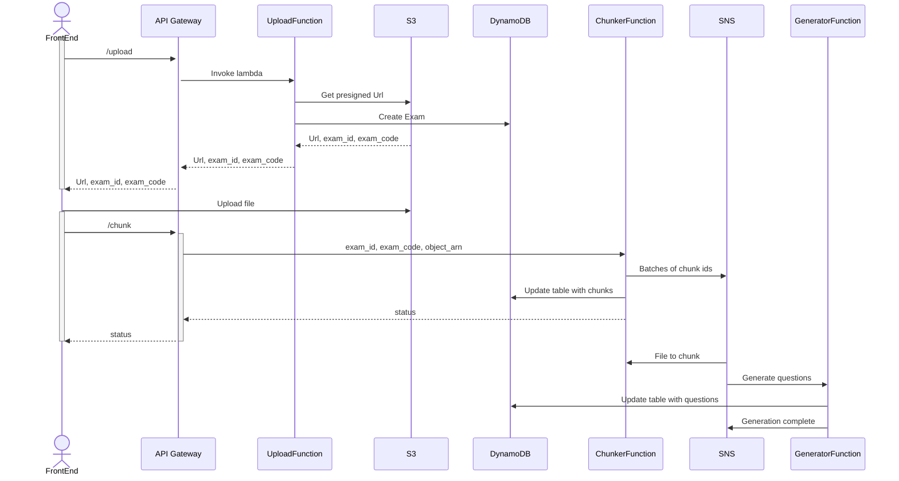

```mermaid
sequenceDiagram
  actor fe as FrontEnd
  participant ag as API Gateway
  participant uf as UploadFunction
  participant S3
  participant ddb as DynamoDB
  participant cf as ChunkerFunction
  participant SNS
  participant gf as GeneratorFunction

  # Upload file - Get presigned URL
  activate fe
  fe ->>+ ag: /upload
  ag ->> uf: Invoke lambda
  uf ->> S3: Get presigned Url
  uf ->> ddb: Create Exam
  S3 -->> uf: Url, exam_id, exam_code
  uf -->> ag: Url, exam_id, exam_code
  ag -->> fe: Url, exam_id, exam_code
  deactivate fe

  # Upload file - Upload to presigned URL
  fe ->> S3: Upload file

  # Chunk File
  activate fe
  fe ->>+ ag: /chunk
  ag ->> cf: exam_id, exam_code, object_arn
  cf ->> SNS: Batches of chunk ids
  cf ->> ddb: Update table with chunks
  cf -->> ag: status
  ag -->>-fe: status
  deactivate fe

  SNS ->> cf: File to chunk


  SNS ->> gf: Generate questions
  gf ->> ddb: Update table with questions
  gf ->> SNS: Generation complete
```
