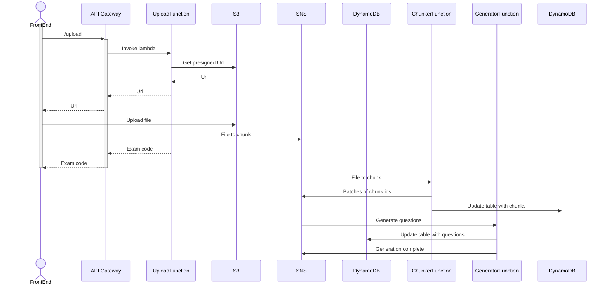

```mermaid
sequenceDiagram
  actor fe as FrontEnd
  participant ag as API Gateway
  participant uf as UploadFunction
  participant S3
  participant SNS
  participant ddb as DynamoDB
  participant cf as ChunkerFunction
  participant gf as GeneratorFunction


  activate fe
  fe ->>+ ag: /upload
  ag ->> uf: Invoke lambda
  uf ->> S3: Get presigned Url
  S3 -->> uf: Url
  uf -->> ag: Url
  ag -->> fe: Url
  fe ->> S3: Upload file
  uf ->> SNS: File to chunk
  uf -->> ag: Exam code
  ag -->>- fe: Exam code
  deactivate fe

  SNS ->> cf: File to chunk
  cf ->> SNS: Batches of chunk ids
  cf ->> DynamoDB: Update table with chunks

  SNS ->> gf: Generate questions
  gf ->> ddb: Update table with questions
  gf ->> SNS: Generation complete
```
