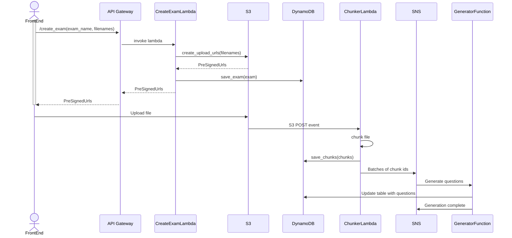

```mermaid
sequenceDiagram
  actor fe as FrontEnd
  participant ag as API Gateway
  participant cel as CreateExamLambda
  participant S3
  participant ddb as DynamoDB
  participant cl as ChunkerLambda
  participant SNS
  participant gf as GeneratorFunction

  # Upload file - Get presigned URL
  activate fe
  fe ->>+ ag: /create_exam(exam_name, filenames)
  ag ->> cel: invoke lambda
  cel ->> S3: create_upload_urls(filenames)
  S3 -->> cel: PreSignedUrls
  cel ->> ddb: save_exam(exam)
  cel -->> ag: PreSignedUrls
  ag -->> fe: PreSignedUrls
  deactivate fe

  # Upload file - Upload to presigned URL
  fe ->> S3: Upload file

  # Chunk File

  S3 ->> cl: S3 POST event
  cl ->> cl: chunk file
  cl ->> ddb: save_chunks(chunks)
  cl ->> SNS: Batches of chunk ids

  # Generate QA

  SNS ->> gf: Generate questions
  gf ->> ddb: Update table with questions
  gf ->> SNS: Generation complete
```
